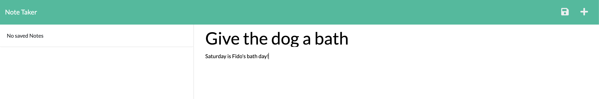
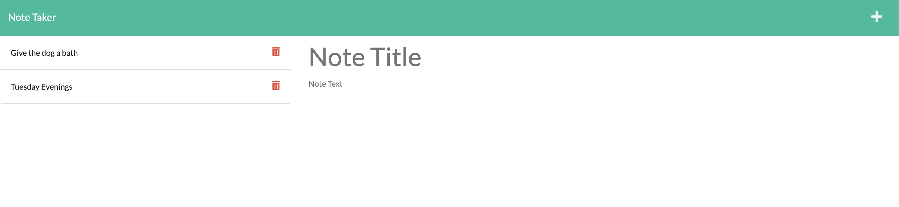

# Note Take App


## Description

This project is a Note Taker application that can be used to write, save, and delete notes. This application uses an Express.js back end and will save and retrieve note data from a JSON file. This application will also be deployed to Heroku.

## Table of Contents

- [Installation](#installation)
- [Usage](#usage)
- [Tests](#tests)
- [License](#license)
- [Questions](#questions)

## Installation

Run `npm i` to install dependencies. Run `npm start` to launch the app from the terminal and view the app in the browser at `localhost:3001`.

### Or visit the deployed application at https://secret-dusk-35441.herokuapp.com/

## Usage

The user can use this app to take notes and save them for review later. The user can also delete notes as desired.

### Screenshot of Note Taker without saved notes: 

### Screenshot of Note Taker with a new, unsaved note: 

### Screenshot of Note Taker with saved notes: 

## Acceptance Criteria

```
GIVEN a note-taking application
WHEN I open the Note Taker
THEN I am presented with a landing page with a link to a notes page
WHEN I click on the link to the notes page
THEN I am presented with a page with existing notes listed in the left-hand column, plus empty fields to enter a new note title and the note’s text in the right-hand column
WHEN I enter a new note title and the note’s text
THEN a Save icon appears in the navigation at the top of the page
WHEN I click on the Save icon
THEN the new note I have entered is saved and appears in the left-hand column with the other existing notes
WHEN I click on an existing note in the list in the left-hand column
THEN that note appears in the right-hand column
WHEN I click on the Write icon in the navigation at the top of the page
THEN I am presented with empty fields to enter a new note title and the note’s text in the right-hand column
```

## Questions?

Questions about this project can be directed to:

- Email: sherri.a.knight@gmail.com.
- You can view more of my projects at https://github.com/iamjoyfulgirl.

## Tests

N/A

## License


<br />  
Content in this project is covered by the MIT license.

---

Note Taker App - Copyright 2022 Sherri Knight
